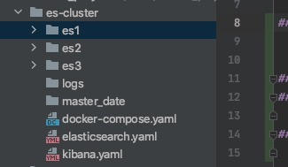

#使用docker-compose 搭建ELK集群

## 一、思路
### 1、使用docker-compose 编排镜像。容器内使用到的一些配置项，使用配置文件进行使用。es的配置文件也是使用的yaml文件格式。

### 2、通过配置文件，确定集群中首次启动的master节点。

### 3、配置kibana，只要首次连接上master节点就行。

## 二、文件tree



### 遇到的问题
#### 1、docker的内存不够
   导致的问题就是报错137，然后推出
#### 2、在es的配置文件中，由于是复制过来的文件内容，忘记修改ip地址
   导致就是master节点找不到salve节点


### 参考文献
* https://www.cnblogs.com/cocowool/p/docker-compose-elk-cluster.html
* https://www.jianshu.com/p/a26c8c7226d7


### 源码
#### 1、docker-compose配置文件
```yaml
version: "2.1"
services:
  es-node1:
    image: docker.elastic.co/elasticsearch/elasticsearch:7.1.0
    container_name: es-node1
    hostname: es-node1
    expose:         #不会将端口暴露给容器外应用
      - "9001"
    ports:          #将端口暴露到宿主机中
      - "9200:9200"
      - "9300:9300"
    volumes:
      - /Users/zhangkui/code/docker_project/es-cluster/es1/elasticsearch.yaml:/usr/share/elasticsearch/config/elasticsearch.yml
      - /Users/zhangkui/code/docker_project/es-cluster/es1/data:/usr/share/elasticsearch/data
      - /Users/zhangkui/code/docker_project/es-cluster/logs:/usr/local/elasticsearch/logs
    environment:
      - cluster.name=es-cluster
      - bootstrap.memory_lock=true
      - "ES_JAVA_OPTS=-Xms1024m -Xmx1024m"
    ulimits:
      memlock:
        soft: -1
        hard: -1
    networks:
      es-cluster-network:
        ipv4_address: 172.21.0.10
  es-node2:
    image: docker.elastic.co/elasticsearch/elasticsearch:7.1.0
    container_name: es-node2
    hostname: es-node2
    expose:         #不会将端口暴露给容器外应用
      - "9002"
    ports:          #将端口暴露到宿主机中
      - "9201:9201" # 这里的容器中的es端口号本来默认的是9200，这里是在配置文件中改为了9201
      - "9301:9301"
    volumes:
      - /Users/zhangkui/code/docker_project/es-cluster/es2/elasticsearch.yaml:/usr/share/elasticsearch/config/elasticsearch.yml
      - /Users/zhangkui/code/docker_project/es-cluster/es2/data:/usr/share/elasticsearch/data
      - /Users/zhangkui/code/docker_project/es-cluster/logs:/usr/local/elasticsearch/logs
    environment:
      - cluster.name=es-cluster
      - bootstrap.memory_lock=true
      - "ES_JAVA_OPTS=-Xms1024m -Xmx1024m"
    ulimits:
      memlock:
        soft: -1
        hard: -1
    networks:
      es-cluster-network:
        ipv4_address: 172.21.0.11
  es-node3:
    image: docker.elastic.co/elasticsearch/elasticsearch:7.1.0
    container_name: es-node3
    hostname: es-node3
    expose:         #不会将端口暴露给容器外应用
      - "9003"
    ports:          #将端口暴露到宿主机中
      - "9202:9202"
      - "9302:9302"
    volumes:
      - /Users/zhangkui/code/docker_project/es-cluster/es3/elasticsearch.yaml:/usr/share/elasticsearch/config/elasticsearch.yml
      - /Users/zhangkui/code/docker_project/es-cluster/es3/data:/usr/share/elasticsearch/data
      - /Users/zhangkui/code/docker_project/es-cluster/logs:/usr/local/elasticsearch/logs
    environment:
      - cluster.name=es-cluster
      - bootstrap.memory_lock=true
      - "ES_JAVA_OPTS=-Xms1024m -Xmx1024m"
    ulimits:
      memlock:
        soft: -1
        hard: -1
    networks:
      es-cluster-network:
        ipv4_address: 172.21.0.12
  kibana:
    image: docker.elastic.co/kibana/kibana:7.1.0
    ports:
      - "5601:5601"
    volumes:
      - /Users/zhangkui/code/docker_project/es-cluster/kibana.yaml:/usr/share/kibana/config/kibana.yml
    environment:
      - ELASTICSEARCH_URL=http://es-node1:9200
    networks:
      - es-cluster-network
networks:
  es-cluster-network:
    driver: bridge
    ipam:
      driver: default
      config:
        - subnet: 172.21.0.0/16
          gateway: 172.21.0.1

```
#### 2、es.yaml
```yaml
cluster.name: elasticsearch-cluster
node.name: es-node1
network.bind_host: 0.0.0.0
network.publish_host: 172.21.0.10
http.port: 9200
transport.tcp.port: 9300
http.cors.enabled: true
http.cors.allow-origin: "*"
node.master: true
node.data: true
cluster.initial_master_nodes: es-node1
discovery.zen.ping.unicast.hosts: ["172.21.0.10:9300","172.21.0.11:9301","172.21.0.12:9302"]
discovery.zen.minimum_master_nodes: 1
```